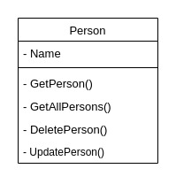

# API Documentation

## UML Diagram



The class diagram above shows the properties and methods that are available on the `Person` resource.

## Base URL

The base URL for this API is: https://hngx-backend-stage-two.onrender.com

## API Endpoints

**List of available endpoints**:

- POST `/api` - Create a person
- GET `/api` - Get all persons
- GET `/api/{id}` - Get a single person
- PUT `/api/{id}` - Update person
- DELETE `/api/{id}` - Delete person

## Create a Person (POST `/api`)

In Postman, you can create a new request for creating a person.

Request:

- Method: POST
- URL: `https://hngx-backend-stage-two.onrender.com/api`
- Headers: `Content-Type: application/json`
- Body (raw JSON):

  ```json
  {
    "name": "John Doe"
  }
  ```

Response:

```json
{
  "status": "success",
  "code": 201,
  "data": {
    "name": "John Doe",
    "_id": "64fdffa418dc863c0c104c42",
    "__v": 0
  }
}
```

## **Get All Persons (GET `/api`)**

Create a request to retrieve all persons:

Request:

- Method: GET
- URL: `https://hngx-backend-stage-two.onrender.com/api`

Response:

```json
{
  "status": "success",
  "code": 200,
  "data": [
    {
      "_id": "64fdffa418dc863c0c104c42",
      "name": "John Doe",
      "__v": 0
    }
  ]
}
```

## **Get Person (GET `/api/{id}`)**

Create a request to retrieve a specific person by their ID:

Request (using `id`):

- Method: GET
- URL: `https://hngx-backend-stage-two.onrender.com/api/1` (replace `1` with the actual ID)

Response:

```json
{
  "status": "success",
  "code": 200,
  "data": {
    "_id": "64fdffa418dc863c0c104c42",
    "name": "John Doe",
    "__v": 0
  }
}
```

## **Update Person (PUT `/api/{id}`)**

Request:

- Method: GET
- URL: `https://hngx-backend-stage-two.onrender.com/api/1` (replace `1` with the actual ID)

  ```json
  {
    "name": "Alexander The Great"
  }
  ```

Response:

```json
{
  "status": "success",
  "code": 200,
  "data": {
    "_id": "64fdf4d941bbe5098557d173",
    "name": "Alexander The Great",
    "__v": 0
  }
}
```

## **Delete Person (DELETE `/api/{id}`)**

Create a request to delete a person by their ID:

Request:

- Method: DELETE
- URL: `https://hngx-backend-stage-two.onrender.com/api/{id}` (replace `1` with the actual ID)

Response:

```json
{
  "status": "success",
  "code": 200,
  "message": "Person deleted"
}
```
